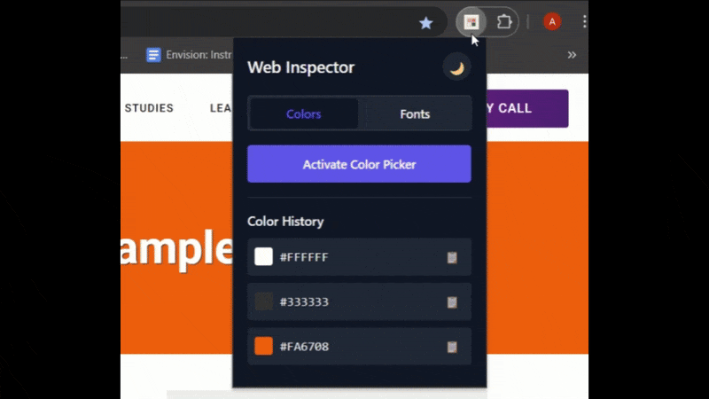

# 🎨 Web Inspector Chrome Extension

**Web Inspector** is a lightweight and elegant Chrome Extension that lets you **pick colors from any website** using the EyeDropper API and **analyze fonts** with a single click.



---

## 🚀 Features

- 🎯 **Color Picker**: Activate the EyeDropper tool to select any pixel on your screen and get the exact HEX color.
- 🅰️ **Font Analyzer**: (Coming Soon) Extract font styles, sizes, weights, and colors from text elements on a webpage.
- 🌙 **Dark Mode Toggle**: Seamlessly switch between light and dark themes.
- 📜 **Persistent History**: Keeps track of your last 5 picked colors and fonts.
- 📋 **One-click Copy**: Easily copy color codes or font details to clipboard.

---

## 🛠️ How It Works

### 1. Activate the Extension
Click the **extension icon** and choose either the `Colors` or `Fonts` tab.

### 2. Use the Tool
- 🔹 Click **Activate Color Picker** to use EyeDropper and pick any color on the current tab.
- 🔹 View the selected color in the history panel and copy it with a click.

### 3. History & Storage
The extension saves up to 5 recent colors and fonts using Chrome's Sync Storage.

---

## 📂 Project Structure

```bash
web-inspector-extension/
│
├── popup.html         # Main popup UI
├── popup.js           # Logic for UI, message passing, and history rendering
├── content.js         # Injected into tabs to activate color picker
├── style.css          # Minimal, theme-friendly styling
├── manifest.json      # Chrome extension metadata
└── README.md          # Project documentation
```

---

## 📦 Installation
For Developers (Manual Installation):
- Clone or download this repository.

- Go to chrome://extensions/ in your Chrome browser.

- Enable Developer Mode.

- Click Load Unpacked.

- Select the folder containing this project.

---

## 🧠 Technologies Used
✅ Vanilla JavaScript

✅ Chrome Extension APIs (chrome.runtime, chrome.storage)

✅ EyeDropper API

✅ CSS Variables for theming

✅ Local & Sync storage

---

## 🧪 Future Improvements
✅ Font analyzer support for live websites

🌐 Color contrast check & accessibility report

💾 Export color/font history

📐 Layout and spacing inspector

---

## 🙌 Author
Made with ❤️ by Appaji Dheeraj
